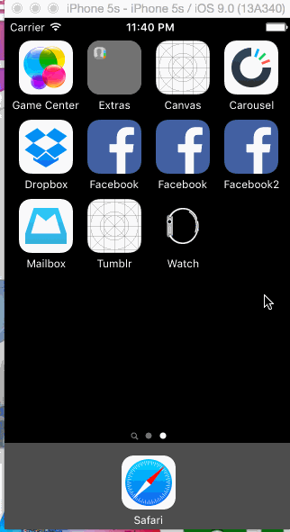

# Tumblr
Homework Week 4

The purpose of this app was to learn how to leverage animations and gestures to create custom navigation.

Time: I spent around 6 hours, and was able to complete 1 optional task.

## What can the app do?

* [x]  User can use custom tab bar navigation items and still have the same experience.
* [x]  Compose button should present a modal screen, dismissable
* [x]  Optional, finished - compose screen is faded in while the buttons animate in

Walkthrough of all the app stories:

 
The GIF was created with [LiceCap](http://www.cockos.com/licecap/).
